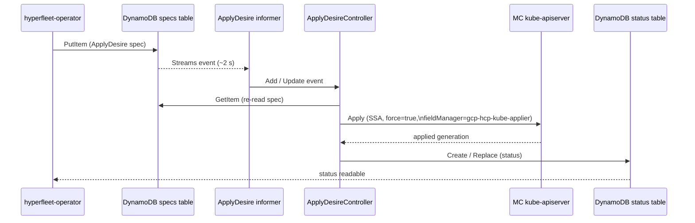

# ApplyDesire Controller

The `ApplyDesireController` reconciles `ApplyDesire` documents. For each
document it reads the desired Kubernetes object from `spec.kubeContent`,
issues a server-side apply (SSA) against the MC kube-apiserver, and writes
the outcome back to the status table.

## Reconcile flow

## Reconcile steps

1. **Dequeue key** — the worker picks a document ID from the rate-limiting work
   queue.
2. **Fetch spec** — `GetItem` on the specs table. If the document is gone
   (`ErrNotFound`) the controller returns without error; the desire has already
   been removed.
3. **Validate** — `spec.targetItem` must carry `version`, `resource`, and
   `name`. `spec.kubeContent` must be non-empty and valid JSON. Validation
   failures set `Successful=False` (reason `PreCheckError`) but do **not** set
   `Degraded=True`; they are treated as client-side misconfiguration.
4. **Decode** — `spec.kubeContent` (stored as a JSON string in the
   `spec_kubeContent` S attribute) is unmarshalled into an
   `*unstructured.Unstructured`.
5. **Server-side apply** — `dynamic.ResourceInterface.Apply` with
   `FieldManager: "gcp-hcp-kube-applier"` and `Force: true`. Force ensures
   the controller can adopt fields previously owned by a different manager.
6. **Write status** — the result generation, observed desire update time, and
   conditions are persisted to the status table with optimistic concurrency
   (`version` counter). The status writer creates the status item if absent or
   replaces it if present.

## Adoption

Because SSA is issued with `Force: true`, the controller will adopt any
existing Kubernetes resource that matches the GVR + name in `spec.targetItem`,
regardless of what field manager previously owned the fields. This is
intentional: it allows desires to take over resources created by other tooling.

## Enqueue policy and cooldown

| Event type | Queued immediately? |
|---|---|
| Add (new spec) | Yes |
| Update where `UpdateTime` changed | Yes |
| Update where `UpdateTime` unchanged (informer resync, own status write echo) | Only if cooldown allows |

The cooldown gate permits at most one reconcile per document per
**10 minutes** for unchanged desires. This prevents the controller from
busy-looping over its own status writes, which feed back through the Streams
informer as `MODIFY` records.

On error the workqueue rate-limiter requeues the key with exponential backoff.

## Conditions

Both conditions are written on every reconcile pass.

### `Successful`

| Reason | Status | Meaning |
|---|---|---|
| `ReconcileSuccess` | `True` | SSA completed; `status.appliedResourceGeneration` is current |
| `PreCheckError` | `False` | Spec is invalid (missing fields, bad JSON) |
| `ReconcileError` | `False` | Kube API returned a 4xx or the SSA call itself failed |

### `Degraded`

| Value | Meaning |
|---|---|
| absent / `False` | No infrastructure problem |
| `True` | A non-client, non-precondition error occurred (e.g. kube-apiserver unreachable, DynamoDB error) |

Client errors (HTTP 4xx from kube-apiserver) and pre-check errors set
`Successful=False` but leave `Degraded` absent — they reflect desire
misconfiguration, not controller health.

## KubeContent wire format

`spec.kubeContent` is stored in DynamoDB as a JSON string in the
`spec_kubeContent` S attribute. The controller unmarshals it on read. The
same JSON-string convention applies to `status.kubeContent` in the status
table (`status_kubeContent` S attribute).

For the hyperfleet-operator side of ApplyDesire — how specs are written and
status consumed — see the
[hyperfleet-operator cluster controller doc](https://github.com/typeid/hyperfleet-operator/blob/main/docs/cluster-controller.md).
