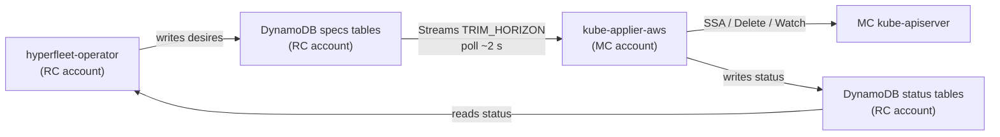

# Architecture

`kube-applier-aws` is the AWS/DynamoDB port of `kube-applier-gcp`. It runs one
controller replica per Management Cluster (MC) and bridges the desire loop
written by [hyperfleet-operator](https://github.com/typeid/hyperfleet-operator)
into live Kubernetes objects on that cluster.

## System overview



The controller holds no state beyond leader-election leases. All desire input
and status output flows through DynamoDB.

## DynamoDB table layout

Six tables are provisioned per MC in the RC account. Table names follow the
prefix convention passed to the controller via `--specs-table` and
`--status-table` flags (ARN form in production):

| Table suffix | Direction | Streams | PITR |
|---|---|---|---|
| `{mc}-specs-applydesires` | hyperfleet-operator → controller | `NEW_AND_OLD_IMAGES` | non-ephemeral |
| `{mc}-specs-deletedesires` | hyperfleet-operator → controller | `NEW_AND_OLD_IMAGES` | non-ephemeral |
| `{mc}-specs-readdesires` | hyperfleet-operator → controller | `NEW_AND_OLD_IMAGES` | non-ephemeral |
| `{mc}-status-applydesires` | controller → hyperfleet-operator | — | non-ephemeral |
| `{mc}-status-deletedesires` | controller → hyperfleet-operator | — | non-ephemeral |
| `{mc}-status-readdesires` | controller → hyperfleet-operator | — | non-ephemeral |

The partition key in every table is `documentID` (string). There are no sort
keys or secondary indexes.

## Document ID scheme

Every desire document carries a deterministic UUID v5 as its `documentID`:

```
documentID = uuid.NewSHA1(NamespaceUUID, "{taskKey}/{group}/{version}/{resource}/{namespace}/{name}")

NamespaceUUID = a3f1b2c4-d5e6-4f7a-8b9c-0d1e2f3a4b5c
```

The same inputs always yield the same UUID. Crash-and-retry by the writer
computes the same ID and hits the `ErrAlreadyExists` guard on the DynamoDB
`ConditionExpression` rather than creating a duplicate. Different `taskKey`
values (e.g. different hyperfleet-operator field managers) produce different
UUIDs for the same Kubernetes resource.

The namespace UUID is shared between this repository and hyperfleet-operator.
It must never be changed after initial deployment — doing so would invalidate
all existing document IDs.

## Informers and change detection

Each specs table is watched via two mechanisms:

1. **Initial list (Scan)** — on startup the informer issues a full `Scan` to
   populate its in-memory store.
2. **DynamoDB Streams shard polling** — the stream watcher opens every shard at
   `TRIM_HORIZON` and polls for new records in a tight loop. End-to-end latency
   from a spec write to a controller reconcile is approximately 2 seconds.

The stream watcher translates `INSERT` and `MODIFY` records into `Added` /
`Updated` events on the shared informer. `REMOVE` records are not surfaced
because desire deletion is handled by the `DeleteDesire` type rather than by
removing the spec item.

## Optimistic concurrency

The status tables use a `version` counter and a DynamoDB
`ConditionExpression` to prevent lost updates:

- `Create` — succeeds only when the item does not exist
  (`attribute_not_exists(documentID)`).
- `Replace` — increments `version` and conditions on the previous value
  (`version = :expected`).

Concurrent writes by stale replicas (before leader election converges) are
rejected with `ErrPreconditionFailed`. The status writer retries with a fresh
`Get` → mutate → `Replace` cycle.

## Leader election

One controller replica holds the leader lease at any time. Leases are stored as
Kubernetes `Lease` objects in the controller's own namespace. The lease name is
configurable via `--leader-election-id` (default: `kube-applier`). Only the
leader runs the reconcile workers; standby replicas wait.

## Cross-account access

The MC account holds the EKS cluster. The RC account holds the DynamoDB tables.
[EKS Pod Identity](https://docs.aws.amazon.com/eks/latest/userguide/pod-identities.html)
associates the `kube-applier` ServiceAccount in the `kube-applier` namespace
to an IAM role in the MC account. That role carries two inline policies
(specs: read + Streams; status: read-write) scoped to the RC account table ARNs.
No static credentials are used. See [deployment.md](deployment.md) for the
full IAM details.

The `spec.managementCluster` field carried inside each desire document is
metadata only. Isolation between MCs is enforced by table naming (`{mc}-*`)
and IAM — each controller role is scoped to its own MC's tables.

## Scale characteristics

| Dimension | Behaviour |
|---|---|
| Replicas | 1 active (leader elected); N standby |
| Per-table concurrency | Configurable worker threadiness (default: 2) |
| Streams lag | ~2 s end-to-end under normal conditions |
| ApplyDesire cooldown | 10 min for unchanged desires |
| DeleteDesire cooldown | 1 min (short to service finalizer drain) |
| ReadDesire resync | 60 s unconditional ticker |

## Divergence from kube-applier-gcp

| Dimension | GCP (Firestore) | AWS (DynamoDB) |
|---|---|---|
| Storage | Firestore named databases | DynamoDB tables |
| Change stream | gRPC `collection.Snapshots()` | DynamoDB Streams TRIM_HORIZON shard poll (~2 s) |
| Concurrency guard | Firestore `LastUpdateTime` precondition | `version` counter + `ConditionExpression` |
| API errors | gRPC status codes | Go sentinel errors (`ErrNotFound`, `ErrPreconditionFailed`, `ErrAlreadyExists`) |
| Metadata type | `FirestoreMetadata` | `DynamoDBMetadata` |
| `KubeContent` wire format | Firestore nested map | JSON string in `spec_kubeContent` / `status_kubeContent` S attribute |
| Credential delivery | GKE Workload Identity | EKS Pod Identity (cross-account) |

For the hyperfleet-operator side of the desire loop — how desires are written
and how status is consumed — see the
[hyperfleet-operator architecture doc](https://github.com/typeid/hyperfleet-operator/blob/main/docs/architecture.md).
