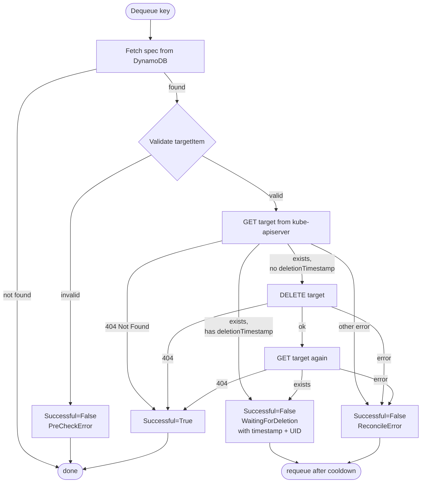

# DeleteDesire Controller

The `DeleteDesireController` reconciles `DeleteDesire` documents. For each
document it ensures the target Kubernetes object is deleted, then reports
`Successful=True` once the object is fully gone. While the object lingers with
a `deletionTimestamp` (e.g. finalizers are draining) the controller reports
`Successful=False` with reason `WaitingForDeletion` and requeues until it
disappears.

## State machine

## Reconcile steps

1. **Dequeue key** — the worker picks a document ID from the rate-limiting work
   queue.
2. **Fetch spec** — `GetItem` on the specs table. If the document is gone
   (`ErrNotFound`) the controller returns without error.
3. **Validate** — `spec.targetItem` must carry `version`, `resource`, and
   `name`. Failure sets `Successful=False` (reason `PreCheckError`); the key is
   not requeued.
4. **Get target** — retrieves the live object from the MC kube-apiserver using
   the dynamic client. If it is already gone, the controller records
   `Successful=True` and stops.
5. **Check `deletionTimestamp`** — if the object already has a deletion
   timestamp (finalizers are draining), the controller records
   `WaitingForDeletion` and relies on the cooldown-driven requeue to poll again.
6. **Delete** — issues `DELETE` via the dynamic client. A 404 from this call is
   treated as success.
7. **Post-delete get** — re-fetches the object to see whether it disappeared
   immediately or has entered terminating state. The result determines the final
   condition for this reconcile pass.
8. **Write status** — conditions and observed update time are persisted to the
   status table with optimistic concurrency.

## Enqueue policy and cooldown

| Event type | Queued immediately? |
|---|---|
| Add (new spec) | Yes |
| Update where `UpdateTime` changed | Yes |
| Update where `UpdateTime` unchanged | Only if cooldown allows |

The cooldown period for DeleteDesire is **1 minute** — shorter than
ApplyDesire's 10-minute default. A `DeleteDesire` in `WaitingForDeletion` state
must poll frequently to detect when finalizers complete and the object
disappears.

## Conditions

### `Successful`

| Reason | Status | Meaning |
|---|---|---|
| `ReconcileSuccess` | `True` | Target object is gone |
| `WaitingForDeletion` | `False` | Object exists with `deletionTimestamp`; controller is polling |
| `PreCheckError` | `False` | `spec.targetItem` is invalid |
| `ReconcileError` | `False` | Kube API call failed |

The `WaitingForDeletion` message includes the `deletionTimestamp` and UID of
the object so the consumer can distinguish finalizer drain from a completely
new object with the same name.

### `Degraded`

| Value | Meaning |
|---|---|
| absent / `False` | No infrastructure problem |
| `True` | Non-client server error (e.g. kube-apiserver unreachable) |

Pre-check errors and client errors (4xx) leave `Degraded` absent.

For the hyperfleet-operator side of DeleteDesire — how specs are written and
status consumed — see the
[hyperfleet-operator cluster controller doc](https://github.com/typeid/hyperfleet-operator/blob/main/docs/cluster-controller.md).
