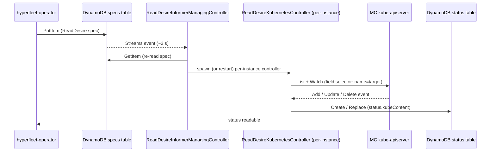

# ReadDesire Controller

The ReadDesire subsystem mirrors live Kubernetes objects back into DynamoDB so
that hyperfleet-operator can read the current state of resources it cares about.
It is implemented as two cooperating controllers.

## Two-controller architecture

```
ReadDesireInformerManagingController   (one instance, per-binary)
  │  watches the ReadDesire specs informer
  │  owns the lifecycle of per-ReadDesire kube reflectors
  │
  ├─► ReadDesireKubernetesController   (one per live ReadDesire document)
  │     single-object ListWatch on the MC kube-apiserver
  │     mirrors observed state → status table
  │
  └─► ReadDesireKubernetesController   (another ReadDesire …)
        …
```

The manager is responsible for **what** controllers exist; each per-instance
controller is responsible for **what** the live object looks like right now.

## Reconcile flow



## Manager reconcile steps

1. **Dequeue key** — document ID of a ReadDesire.
2. **Fetch spec** — `GetItem` on the specs table. If gone, the manager stops
   any running per-instance controller for that key and returns.
3. **Compare target** — if a per-instance controller is already running for
   this key and its `TargetItem` is unchanged, no action is taken.
4. **Stop old controller** — if `TargetItem` has changed (GVR, namespace, or
   name), the existing per-instance controller is cancelled and the manager
   waits for its goroutine to exit before proceeding.
5. **Build and start** — a new `ReadDesireKubernetesController` is constructed
   for the new target and launched in its own goroutine with a child context.

## Per-instance controller reconcile steps

Each `ReadDesireKubernetesController` runs a single-object ListWatch scoped to
the target GVR + name (using `metav1.SingleObject` field selector):

1. **Start informer** — launches a `SharedIndexInformer` backed by the
   single-object ListWatch. Waits for the cache to sync before processing.
2. **Event handler** — every Add, Update, or Delete event on the target object
   enqueues the ReadDesire key.
3. **Unconditional resync ticker** — a `60-second` ticker enqueues the key
   regardless of kube events. This ensures non-existence (`object not found`) is
   reflected even when the Watch stream delivers no events.
4. **SyncOnce** — reads the object from the informer store. If the object is
   present, marshals it to JSON and stores it in
   `status.kubeContent` (`status_kubeContent` S attribute in DynamoDB). If
   absent, sets `status.kubeContent` to nil. Writes the result to the status
   table with optimistic concurrency.

## Target change handling

When `spec.targetItem` changes (e.g. the desire is retargeted to a different
resource or namespace), the manager:

1. Cancels the existing per-instance controller's context.
2. Blocks until its goroutine closes its `done` channel.
3. Starts a fresh per-instance controller for the new target.

No status cleanup is performed — the new per-instance controller overwrites the
status table item on its first sync.

## Enqueue policy

| Event type | Manager behaviour |
|---|---|
| Add (new spec) | Enqueue immediately |
| Update where `UpdateTime` changed | Enqueue immediately |
| Update where `UpdateTime` unchanged | Cooldown-gated (10 min) |
| Delete | Enqueue immediately (triggers controller stop) |

Per-instance controllers drive their own queue entirely from kube informer
events and the 60-second resync ticker — they do not participate in the
manager's cooldown.

## Conditions

### `Successful`

| Reason | Status | Meaning |
|---|---|---|
| `ReconcileSuccess` | `True` | `status.kubeContent` reflects current state (present or absent) |
| `PreCheckError` | `False` | `spec.targetItem` is invalid (missing version, resource, or name) |
| `ReconcileError` | `False` | Error reading from the kube informer cache or DynamoDB |

`status.kubeContent` being nil means the object does not exist — this is a
valid terminal state, not an error.

## `status_kubeContent` wire format

The mirrored object is stored in DynamoDB as a JSON string in the
`status_kubeContent` S attribute, consistent with the JSON-string convention
used for `spec_kubeContent` in the specs tables.

## Development tool note

`desirectl get` creates a transient `ReadDesire` document to read a single
Kubernetes object on demand, then waits for `status.kubeContent` to be
populated before printing and deleting the document. This is a developer
convenience tool; `ReadDesire` documents are not normally created by hand in
production.

For the hyperfleet-operator side of ReadDesire — how specs are written and
status consumed — see the
[hyperfleet-operator nodepool controller doc](https://github.com/typeid/hyperfleet-operator/blob/main/docs/nodepool-controller.md).
